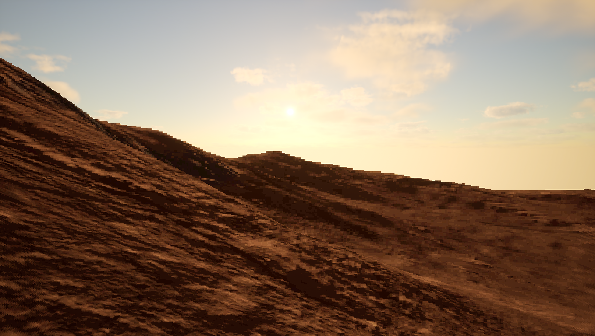
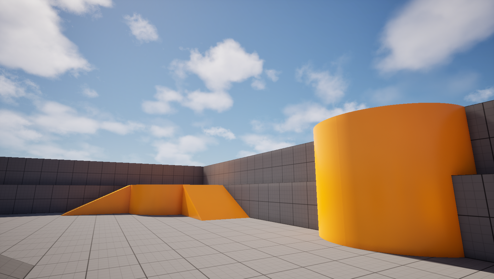
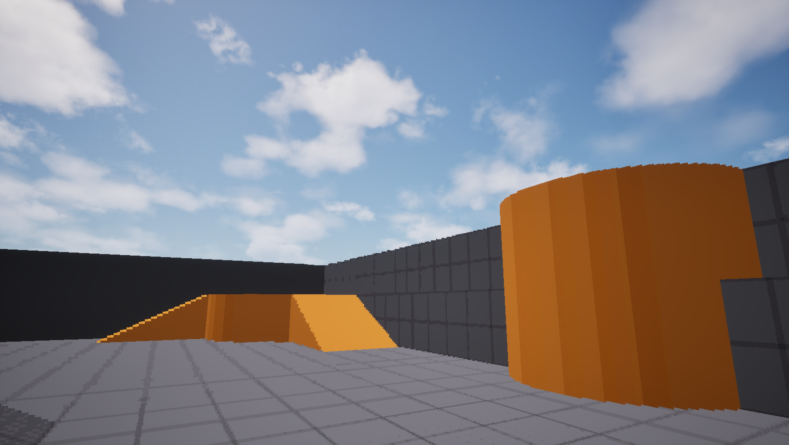

# TexelSplatPlugin

UE5 plugin implementing real-time 3D pixel art via texel splatting, based on Ebert 2026 ([arXiv 2603.14587](https://arxiv.org/abs/2603.14587)).

<table>
  <tr>
    <td></td>
    <td></td>
  </tr>
    <tr>
    <td></td>
    <td></td>
  </tr>
</table>

## What it does

Scene geometry is rasterized into a cubemap array from fixed world-space probe origins. Each cubemap texel is shaded in a compute pass and splatted to screen as a world-space quad. Because pixel assignment is tied to probe position rather than camera position, the result is stable under camera rotation and translation thus no pixel crawl.

Pipeline:

1. Capture - custom `FMeshPassProcessor` rasterizes static geometry into 384×384 cubemap faces per probe, writing albedo, packed normals, Chebyshev depth, and entity ID into a 18-slice `Texture2DArray` (3 probes × 6 faces).
2. Shading - compute shader applies Lambert diffuse and OKLab posterization (32 bands, round-to-nearest) per cubemap texel.
3. Splat - vertex shader reconstructs world-space position from Chebyshev depth using `p = o + (d / ||r||∞) * r`, expands each texel to a screen-facing quad with grazing-angle gap fill, and writes to SceneColor via depth test.

Three-probe system (Eye / Grid / Prev) with 100 UU grid step and 4×4 Bayer crossfade handles translation stability and probe transitions. SVE hooks: `PostRenderBasePassDeferred_RenderThread` for capture, `PrePostProcessPass_RenderThread` for shading and splatting.

## Requirements

- UE5.7 source build - private engine headers (`FSceneRenderer`, `FMeshPassProcessor` internals) are required and not shipped with the installed build.
- The plugin hooks into the deferred rendering path and requires `r.AntiAliasingMethod 0` (TSR off) for clean output.
- Disable Nanite on any mesh you want captured - Nanite meshes bypass `PrimitiveSceneInfo->StaticMeshes`. Keep "Generate Nanite Fallback Meshes" enabled in Project Settings.
- Visual Studio 2026: two engine source files need manual edits before building - `VCEnvironment.cs` line 502: `Compiler = WindowsCompiler.VisualStudio2026;` and `DatasmithMax2017.Target.cs` line 43: `WindowsPlatform.Compiler = WindowsCompiler.Default;`

## Setup

Copy the `TexelSplatPlugin` folder into your project's `Plugins/` directory and rebuild. The plugin registers automatically via `PostConfigInit`.

No Blueprint or editor configuration needed - the SVE registers on startup and runs every frame when `r.TexelSplat.Enable 1` (default).

## Status

WIP. Current state: 18-pass rasterization loop stable, full pipeline end-to-end confirmed. Ambient term in the shading pass and near-camera discard threshold are being tuned.

Active bug: the most glaring one at least, the last mesh processed by the capture loop renders with UE's default checkerboard material. Root cause is `FMeshMaterialShaderElementData` being stack-allocated inside `AddMeshBatch` - `DrawDynamicMeshPass` defers execution and the stack is overwritten by the time the GPU draws.

## Reference

Ebert, D. (2026). *Texel Splatting*. arXiv:2603.14587. Source: [github.com/dylanebert/texel-splatting](https://github.com/dylanebert/texel-splatting) (MIT).
